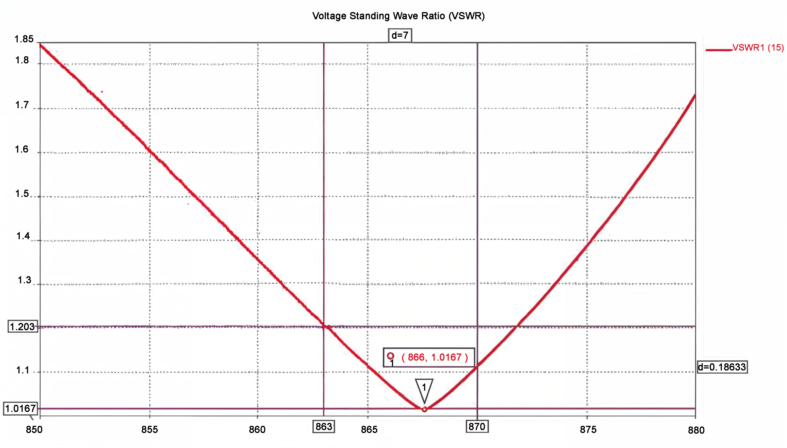

# Boardoza Omni-5.8dbi LoRa Omni Antenna

The **Boardoza Omni-5.8dbi** is an outdoor omnidirectional antenna designed for **LoRa, NB-IoT, M2M, and ISM-band wireless applications** operating across the **863 - 870 MHz** frequency range. With **5.8 dBi gain, 360° horizontal beam width, and 50 Ω impedance**, it provides omnidirectional RF connectivity for compatible wireless systems operating within this frequency band.

Designed according to the **Euro Region (EU863-870) frequency plan**, the antenna uses an **SMA (Female)** connector and features an **IP67-rated**, UV-resistant PVC enclosure for outdoor installations. Typical applications include ***smart agriculture, home automation, geographic surveying, traffic and road information systems, industrial M2M networks, and other LoRa/ISM wireless systems**. 

|Product|
|:---:|
||

---

## Key Features

- **Omnidirectional RF Coverage:** Provides a 360° horizontal radiation pattern for broad wireless coverage without directional alignment.
- **863 - 870 MHz Operation:** Designed for wireless applications operating within the Euro Region (EU863-870) frequency range.
- **5.8 dBi Antenna Gain:** Provides 5.8 dBi gain for compatible LoRa, NB-IoT, M2M, and ISM-band applications.
- **Outdoor Design:** Features IP67 protection and a UV-resistant PVC housing for outdoor use.
- **Flexible Installation:** Supports wall or pipe mounting using galvanized mounting hardware.

---

## Technical Specifications

**Model:** Omni-5.8dbi Antenna   
**Manufacturer:** Boardoza  
**Frequency Range:** 863 - 870 MHz  
**Gain:** 5.8 dBi  
**VSWR:** ≤ 1.2  
**Impedance:** 50 Ω  
**Horizontal Beam Width:** 360°  
**Vertical Beam Width:** 34°  
**Connector:** SMA (Female), IP67  
**Housing Material:** UV-Resistant PVC  
**IP Rating:** IP67  
**Installation Method:** Wall or Pipe Mount (Galvanized)  
**Operating Temperature:** -40°C to +60°C  
**Dimensions:** Ø20mm x 610mm  

---

## LoRaWAN EU863-870 Compatibility

The Omni-5.8dbi is designed for operation within the 863 - 870 MHz frequency range. 

### Uplink

| Frequency | Modulation / Data Rate |
| :---: | --- |
| 868.1 MHz | SF7BW125 to SF12BW125 |
| 868.3 MHz | SF7BW125 to SF12BW125 and SF7BW250 |
| 868.5 MHz | SF7BW125 to SF12BW125 |
| 867.1 MHz | SF7BW125 to SF12BW125 |
| 867.3 MHz | SF7BW125 to SF12BW125 |
| 867.5 MHz | SF7BW125 to SF12BW125 |
| 867.7 MHz | SF7BW125 to SF12BW125 |
| 867.9 MHz | SF7BW125 to SF12BW125 |
| 868.8 MHz | FSK |

### Downlink

| Channel | Frequency / Configuration |
| :---: | --- |
| RX1 | Uplink Channels 1-9 |
| RX2 | 869.525 MHz - SF9BW125 |

---

## Radiation Pattern

The antenna provides an omnidirectional radiation characteristic with a specified **360° horizontal beam width** and **34° vertical beam width**. 

---

## VSWR (Voltage Standing Wave Ratio)

The specified antenna **VSWR is ≤ 1.2** across the intended operating range. 

---

## Datasheet

[Omni-5.8dbi User Manual.pdf](./assets/LoRa%20Omni%20Antenna%20User%20Manual.pdf)

---

## Version History

- V1.0.0 - Initial Release

---

## Support

- If you have any questions or need support, please contact <support@boardoza.com>

---

## **License**
### **Hardware Design**

[![CC BY-SA 4.0][cc-by-sa-shield]][cc-by-sa]

All hardware design files are licensed under [Creative Commons Attribution-ShareAlike 4.0 International License][cc-by-sa].

[cc-by-sa]: http://creativecommons.org/licenses/by-sa/4.0/
[cc-by-sa-shield]: https://img.shields.io/badge/License-CC%20BY--SA%204.0-lightgrey.svg
